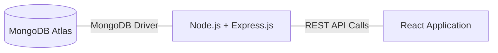

**What is the node js**
-------------------------
  > It is initially normally js, that was used in frontned only to enhance UI and interaction on  web -> (btn, dynamic, color, popups).

    > open source tool that lets you run JavaScript outside the web browser  
NODE JS
> runs on -(Windows, Mac, Linux)
> allow to execute js code outside of the browser.
> and alow you to development on server-side with js.
> built on chroms v8 javascript engin,
> Node.js is designed for building scalable network applications efficiently
## Why Node js.
> Real-time applications (chats, gaming, collaboration tools)
> APIs and microservices
> Data streaming applications
> Command-line tools
> Server-side web applications

## What is a Node.js File?
> it contains code that runs on the server.
> it has .js extension and it can run with the [node filename] command.
## Download and Install Node.js
1. Go to [https://nodejs.org](https://nodejs.org/)
2. Download the **LTS (Long Term Support)** version
3. Run the installer and follow the instructions
### Verify Installation
```
node --version
npm --version
```
## WHAT IS THE KEY DIFFERENT B/W NODE.JS AND BROWSER BOTH RUNS JS
> They have different environment and capabilities
### node js is designed for server-side development,  while browsers are for client-side applications

  > **API's **
**nodejs provides API's** for (File system, fetch, networking, and OS). Which Browser do not provide, **browsers provide (DOM, FETCH,and UI** API's NOT AVAILABLE IN NODE JS)

> **Global Objects** Node.js uses `global`; browsers use `window` or `self`

> Modules Node.js uses CommonJS (require) and ES Modules (import); Browser  use ES modules or plain <script> tags

> Security Browser run in a sandbox with limited access, Node.js has full access to the file system and network.

> Event Loop Both environment use loop, but node.js has additional API's for timers, process, etc,

> Environment Variables Nodes.js can acess environment variables(process.env)-[env -> environment variables] browser cannot.

> Package Management Node.js uses npm/yarn ; Browser use CDN's (connection delivery network) or Bundlers

## what we will learn 
> How to install and run Node.js
> Core concepts like modules and the event loop
> How to build web servers and APIs
> Working with databases and files
> Deploying Node.js applications


**NODE JS**
--------------------------
  > Open Source
  > Server Side
  > JavaScript 
  > Runtime Environment - That allow to RUN JS code on server

> Node JS allows to devlopers to use same language in front end and backend

> Node JS is Build on top of '**CHROME V8 JS Engin**' 
> Which is Known for high performance and Efficient Execution of js code

V8-ENGIN 
  > Open Source js engin  devloped by GOOGLE  (TO USE IN THE GOOGLE CHROME WEB BROWSER)
----------------------------------------------------------------
**HUMAN READABLE JS CODE ---> v8-Engin ---> MACHINE READABLE LANGUAGE**
-----------------------------------------------------------------
# JS SOURCE CODE -> V8-ENGINE --> EXECUTE --> CPU WORKS

#Client-side(FRONTEND)RANDER // Server-side(BACKEND)-PROCESS

1) install **#node** > js run time environment that help to run the js on locally out of browser.

2) configure **# vs code** > code editor where will write our js code.

3) **postman** download and install the ->
(this is the 3rd party software that help us to 
**test the API's** );

# HOW TO RUN THE JAVASCRIPT CODE? (4 ways to run)
1 > **Online Compiler **(online compiles) - web applications.
2 > **Web Browser** (console of any browser we can compile the --> v8 engine that compile js code in browser) every browser provides the console there we can run our js code.

3 > **Terminal** (cmd -- terminal we can also execute js code)
4 > **Visual Studio Code** (we runs our code in the terminal on vs code -> node fi
lename);

# NPM (NODE PACKAGE MANAGER)
> **express** -> npm i express (to istall the Express js) 
#  npm init 
> when we start any project in backend(server) (statup project)
# node_modules
> There is the all dependencies are available, 
# Package.json
> it stores the details about aur project
details like >
      Packeages name, version, meta data, etc

# package-lock.json 
> ensure detailed of every package installed with -v, sub dependencies, store detailed, discount everything
> it's like a detailed billed

# NODEMON 
[**npm i nodemon**] -> **Live compiler whenever project get change**  when ever file get changed then it runs real time no need to complile manually. 
> start nodemon fileName,
>> Now when ever file change nodemon auto save and execute the code in node execution environment.

```const fs = require('fs'); // systemm inbuild functionWhat is the node js
initially js was used in frontned only to enhance UI and interaction on  web -> (btn, dynamic, color, popups).
```
# Server in NodeJS
> A server is a computer program that is responsible for preparing and delivering data to other computers.

1. USER ----> WORK STATTION 
2. INTERNET ----> USER GET CONNECTED TO INTERNET 
3. INTERNET GET REQUEST TO THE SERVER 
4. THEN ACTUAL DATA RETURN THRUE THE SERVER.

### JSON
> organized formate for exchanging data from computers
> json is a lighweight
> structured and organized Data because in most contexts JSON is represnted as STRING.

### Convert JSON FORMATE TO THE OBJECT FORMATE
> Server return the data as the **JSON FORMATE**
> Then we convert the json formate to object using **JSON.parse(jsonfile)** 
> convert the json string to the normal object -- output will be the normal as the object,

### Convert OBJECT TO THE JSON FORMATE
> User Data get convert into the **JSON FORMATE**. > **JSON.stringify(objectdata)**

> typeOF JSON FORMATE WILL ALWAYS -**STRING**

**SERVER IS THE COMPUTER PROGRAM WHO LISTEN USER INSTRUCTION AND RESPONSE HIM AS PER THE USER REQUIREMENT.** IN THE JSON FORMATE.

# What is API and ENDPOINT
ENDPOINT -> it means that server has limit as it is programmed.
API'S -> where the all end-points of server is written called the api, means (programs, predefined-features, that we will use)

1. server dead
2. server live
3. server stopped

# CREATE SERVER -
**Express js** -> it is the one of the popular framework that help to create the server, web application, and api's using node js 
 **when you will create an Express.js application, **
> you are setting up the foundation for handling incomming requests 
> and defing how you'r application respond to them.

** LOCAL HOST refers to the our OWN HOME**
> After creating a server in node.js you can access you'r environment in 'LOCALHOST'.

1. **PORT NUMBER** - SERVER LIKE A BUILDING THERE ARE SERVEAL ROOMS BUT WE HAVE TO DEFINE ONLY ONE OF THEM.
2. ROOM NO. IS YOU CAN UNDERSTAND LIKE THE **PORT NIMBER**

# Let's Start
1. **[ npm i express] -> install the express.** (to install the express.js we have to install it locally, we know that whenever we want to initialize any external liberary / framework 1st we need to install it locally then we can initial with it easily.)
2. TO CREATE SERVER. 
```
const express = require('express')
const app = express();

app.get('/', function(req,res){
   res.send('hello world')
})

app.listen(3000) // this is the port that we are assing to our server.
```

# METHODS TO SHARE DATA
1. *client request using - web-browser*
2. *while server js created on nodejs so that will get back the response. as requeste comming.*
### So there are the lots of methods to 
1. GET
2. POST
3. PATCH
4. DELETE

## GET
just provides access -> suppose when you enter the URL on the browser-> ** You'r Browser sends a GET request to the sever to fetch the web-pages**
```
app.get('/', function(req, res){
res.send('HELLO WORLD')
})
```
> in get** **method it has** function with two parameters (req,res)**

```
const express = require("express");
const app = express();
app.get("/", function (req, res) {
  res.send("hey dear this is me✔️");
});
app.get("/call", function (req, res) {
  res.send("new page rendered✔️");
});
app.get("/order", function (req, res) {
  var customized_idli = {
    name: "rava idli",
    size: "10 cm diameter",
    is_sambhar: true,
    is_chutney: false,
  };
  res.send(customized_idli);
});
app.listen(30, () => {
  console.log("server is on prot num- 30");
});
```

# DATABASE 
> WEB-DEVELOPMENT -> CLIENT + SERVER + DATABASE
> We use the DATABASE to store the multiples categories of data.
>> nowdays market has many databases
1. SQL
2. POSTGRE SQL
3. **MONGO DB**
4. MARIA DB
5. ORACLE

> DATABASE have their own server system to manage and provide access to the data that they store.

> these DATABASE server systems are seprated from the node.js server. But work together to create dynamic and data-drive web-application.

## NODEJS SERVER V/S DATABASE SERVER
> A database server is a specialized computer program or system that manage databases. it store, retrive, and manage data effieciently.

> The database server stores you'r applications data, When you'r node js server needs data, it sends request to the database server, which sends back data to the node.js server
**(as per requirement of the data database server sends the data to the nodejs server) **
---------------------------------------------------------------
> Node.js server is responsible for **handling HTTP Requests from clients** (Like web-browsers) and returning responces 
LIKE :- (http requests comes fom india)
> It process these requests, communicates with database server, and and sends data to the clients.


+-------------------+        +----------------------+        +------------------+
|  Database Server |        |   Back-end Server    |        |      Client      |
+-------------------+        +----------------------+        +------------------+
|                   |       |                      |       |                  |
|  MongoDB Atlas    |<----->|  Node.js + Express   |<----->|  React App       |
|  Database         |       |  (REST API)          |       |  Application     |
|                   |       |                      |       |                  |
+-------------------+        +----------------------+        +------------------+

        (MongoDB Driver)                (REST API Calls)




+------------------------------------------------------------------+

# MONGDB SETUP
> It is a **NoSQL database** — it stores data in a flexible JSON-like format instead of tables & rows.
>>MongoDB document looks like:
```json
{ "id": 1, "name": "Aman", "city": "Delhi" }
```

### Key points:
1. MONGO DB = **Mongo Database**
2. It stores data as **objects/documents**
3. No fixed structure** (schema is optional)**
4. Good for apps like **React + Node.js + Express** (your stack)
5.**Fast and scalable**

>> DATA STRUCTURE
{
  "customer": "Rahul",
  "phone": "09587831646",
  "city": "Greater Noida",
  "items": ["Sofa", "TV", "Fridge"],
  "pickup_pin": 201307
}

## How to Install MongoDB on Windows
> MongoDB, a popular NoSQL database, is used by numerous users for its flexibility, scalability, and performance

### INSTALLATION MONGO DB COMMUNITY 
1. Search on the browser [mongodb download]
2. Now Download the [mongodb] as you's system reuirement
3. Install MongoDB
4. Configure mongo DB
5. [Install]
6. After clicking on the install button installation of MongoDB begins
7. Complete Installation
8. Set Environment Variables
9. Go to the location where mongo db is installed
10. Start MONGO DB SERVER > **[mongod]**.**When you run this command you will get an error i.e. C:/data/db/ not found.**
11. Create Required Folders 
   a. Now, Open C drive and create a folder named "data"
   b. Inside the data folder create another folder named "db".

> download mongo shell also 
> extrect it on the same location of [mongodb put it at location where the server file is]
> go inside the [mongoshel>bin>mongoshel.exe] copy the file path
> now search the [edit system environment variables]
> click on [environment variables]
> click to open the [path]
> add new [paste the path that you were copied]
> you will now able to run that command to run mongodb server **[mongosh]**

1. Restart MongoDB > **[mongosh]** > **Now the mongo db will start successfully.**
**Run the MongoDB Shell **
1. Connect to MongoDB Server > [mongosh].** You are now connected to the MongoDB shell** [ show dbs] - to see the all databases
## NOW THE MONKGO DATABASE IS READY TO INITIATE THE DATABASE.
1. Create the NEW-DATABSE > [use database_name].

### Step 1: ****Starting the server****
1. Open the Run dialog (press ****Windows key + R).****
2. Type ****services.msc and press Enter****. The Services window will open.
3. Locate the service named "****MongoDB****" or similar (check your documentation if unsure).
4. Right-click on the service and select "****Start****".

# WHAT'S DIFFERENCE B/W SQL AND MONGODB
## In SQL we store data in tables, in columns and rows.
>  **TABLE  - ROW/RECORDS - COLUMNS**
## In MONGODB store data in json formate.
> table**(COLLECTION)** - Row**(DOCUMENT)** - Columns**(Field)**


### MONGODB COMMANDS
**> TO START THE MONGO SHELL**
```monogosh```
**> TO SHOW THE ALL DATABASES**
```
show dbs
or
show databases
```
**> WANT TO USE DATABASE ANYONE YOU WANT**
```use databasename```
**> TO SEE THE TABLES INSIDE ANY DATABASE**
```show collections```
> To Create or Use DATABASE
```use databaseName```
>>❗Important rule:
>>A database will **only appear in `show dbs` after you insert at least one document** into a collection inside it.

> To dropdatabase 
```
use databse_name
db.dropDatabase()
```

> To Create Collection(TABLE) or Show collections
```
db.createCollection('tableName');
show collections
```

> To insert the data inside the collection
``` db.collectionName.insertOne({user:'usdhfh', pas:'HJF44U'});```

> To see the all data of collection(table)
``` db.collectionName.find()```

> To find the data from the collection
``` 
db.collectionName.find({usename:{$lt: 18});
db.data.find({age : {$lt: 18}});

```
> To update the data
db.data.updateOne({name:'sachin', {$set:{age:24}}});

> To delete in collection
db.data.deleteOne({name:'suman'});

